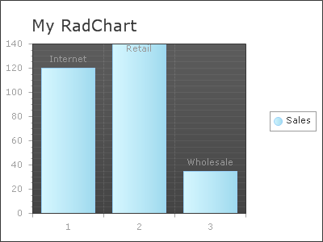

# Creating RadChart Programmatically

>caution  **RadChart** has been replaced by [RadHtmlChart](https://www.telerik.com/products/aspnet-ajax/html-chart.aspx), Telerik's client-side charting component. If you are considering **RadChart** for new development, examine the [RadHtmlChart documentation]() and [online demos](https://demos.telerik.com/aspnet-ajax/htmlchart/examples/overview/defaultcs.aspx) first to see if it will fit your development needs. If you are already using **RadChart** in your projects, you can migrate to **RadHtmlChart** by following these articles: [Migrating Series](), [Migrating Axes](), [Migrating Date Axes](), [Migrating Databinding](), [Features parity](). Support for **RadChart** is discontinued as of **Q3 2014**, but the control will remain in the assembly so it can still be used. We encourage you to use **RadHtmlChart** for new development.

The steps below show how to create a minimal RadChart programmatically.

See the "[create a more complex chart programmatically]()" topic to see how multiple series are created and how appearance can be tailored at run-time.

See the topic "[Multiple Chart Types in a Single Chart]()" to see how multiple series area created programmatically and given different ChartSeriesTypes.

Once the chart is created, the critical steps are creating the [ChartSeries]() and [ChartSeriesItem]() collections. There are two approaches to creating chart series objects. One is to use the default [ChartSeries]() constructor and assign its properties. A second route is to use the RadChart CreateSeries() method to set a number of important properties at once and return the constructed chart series.

1. First add the namespaces that support the objects to be referenced. The Telerik.WebWinControls.UI namespace supports the RadChart declaration and the Telerik.Charting namespace supports the other RadChart objects, e.g. [ChartSeries]() and [ChartSeriesItem]().

	**C#**

		using Telerik.Web.UI;
		using Telerik.Charting;		

	**VB**

		Imports Telerik.Web.UI
		Imports Telerik.Charting

1. Next construct the RadChart itself. To the RadChart instance, assign the chart title using the ChartTitle.TextBlock.Text property.

	**C#**
	
		RadChart radChart = new RadChart();
		radChart.ChartTitle.TextBlock.Text = "My RadChart";		
		
	**VB**
	
		Dim radChart As New RadChart()
		radChart.ChartTitle.TextBlock.Text = "My RadChart"	

1. Construct a new [ChartSeries]() object. Assign a name to the [ChartSeries.]() Set the ChartSeries.Type to be **Bar**. Using the ChartSeries.AddItem() method, add a series of [ChartSeriesItem]() objects to the series Items collection. AddItem() takes as parameters a double "Value" and a string "Label".

	**C#**
	
		// Create a ChartSeries and assign its name and chart type
		ChartSeries chartSeries = new ChartSeries();
		chartSeries.Name = "Sales";
		chartSeries.Type = ChartSeriesType.Bar;
		// add new items to the series,
		// passing a value and a label string
		chartSeries.AddItem(120, "Internet");
		chartSeries.AddItem(140, "Retail");
		chartSeries.AddItem(35, "Wholesale");	
		
	**VB**
	
		' Create a ChartSeries and assign its name and chart type
		Dim chartSeries As New ChartSeries()
		chartSeries.Name = "Sales"
		chartSeries.Type = ChartSeriesType.Bar
		' add new items to the series,
		' passing a value and a label string
		chartSeries.AddItem(120, "Internet")
		chartSeries.AddItem(140, "Retail")
		chartSeries.AddItem(35, "Wholesale")	

1. Finally, add the [ChartSeries]() to the RadChart Series collection and add the RadChart to the page.

	**C#**
	
		// add the series to the RadChart Series collection
			radChart.Series.Add(chartSeries);
		// add the RadChart to the page.
			this.Page.Controls.Add(radChart);	
			
	**VB**
	
		' add the series to the RadChart Series collection
		radChart.Series.Add(chartSeries)
		' add the RadChart to the page.
		Me.Page.Controls.Add(radChart) 	

1. The finished chart in the running project should look like this example:

	

	The alternative to using the [ChartSeries]() object constructor and assigning properties is to use the RadChart CreateSeries() method that lets you pass several properties in the call, including Name, MainColor, SecondColor and ChartSeriesType.

	**C#**
	
		ChartSeries chartSeries = radChart.CreateSeries("Sales",
		System.Drawing.Color.RoyalBlue,
		System.Drawing.Color.LightSteelBlue,
		ChartSeriesType.Bar);				

	**VB**	
	
	    Dim chartSeries As ChartSeries = radChart.CreateSeries("Sales", System.Drawing.Color.RoyalBlue, System.Drawing.Color.LightSteelBlue, ChartSeriesType.Bar)	

# See Also

 * [Building RadCharts]()

 * [Populate RadChart at Design-Time]()

 * [Creating RadChart Declaratively]()

 * [Creating RadChart Programmatically - more complex example]()
