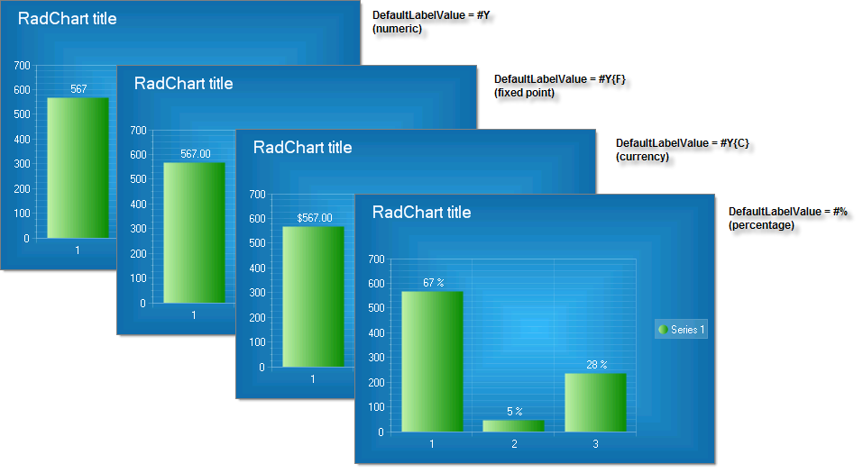

# DefaultLabelValue

>caution  **RadChart** has been replaced by [RadHtmlChart](https://www.telerik.com/products/aspnet-ajax/html-chart.aspx), Telerik's client-side charting component. If you are considering **RadChart** for new development, examine the [RadHtmlChart documentation]() and [online demos](https://demos.telerik.com/aspnet-ajax/htmlchart/examples/overview/defaultcs.aspx) first to see if it will fit your development needs. If you are already using **RadChart** in your projects, you can migrate to **RadHtmlChart** by following these articles: [Migrating Series](), [Migrating Axes](), [Migrating Date Axes](), [Migrating Databinding](), [Features parity](). Support for **RadChart** is discontinued as of **Q3 2014**, but the control will remain in the assembly so it can still be used. We encourage you to use **RadHtmlChart** for new development.

DefaultLabelValue specifies a format for label values that will be displayed automatically if you do not specifically assign text to a chart series item.

* Use "#Y" or "#X" to display numbers from the X or Y axis respectively

* Use "#%" for a percentage of the total sum (of all items).

* Use "#SUM" to display the total of all items.

* "#STSUM" displays the sum of a stacked series.

* "#SERIES" displays the series name.

* "#ITEM" displays the item name.

* You can also use the formatting described in this MSDN article [Standard Numeric Format Strings](https://msdn2.microsoft.com/en-us/library/dwhawy9k.aspx). Use curly brackets to contain the standard numeric formats. For example, you can display Y values as currency by setting DefaultLabelValue to "#Y{C}". See examples in the figure below.

