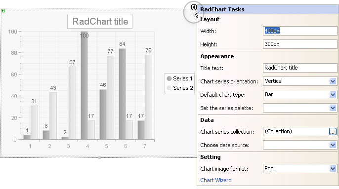

# RadChart SmartTag Menu

>caution  **RadChart** has been replaced by [RadHtmlChart](https://www.telerik.com/products/aspnet-ajax/html-chart.aspx), Telerik's client-side charting component. If you are considering **RadChart** for new development, examine the [RadHtmlChart documentation]() and [online demos](https://demos.telerik.com/aspnet-ajax/htmlchart/examples/overview/defaultcs.aspx) first to see if it will fit your development needs. If you are already using **RadChart** in your projects, you can migrate to **RadHtmlChart** by following these articles: [Migrating Series](), [Migrating Axes](), [Migrating Date Axes](), [Migrating Databinding](), [Features parity](). Support for **RadChart** is discontinued as of **Q3 2014**, but the control will remain in the assembly so it can still be used. We encourage you to use **RadHtmlChart** for new development.

To easily access common tasks and properties click the SmartTag at the upper right corner of the RadChart.

Here you can find the most significant properties for the chart without navigating to the Properties Window.RadChart Tasks are divided into four sections:

**Layout:**

* Assign **Width** and **Height** properties in pixels to set the dimensions for the chart as a whole.

**Appearance**:

* **Title text**: Set the chart title using the "Title text" entry. If you need more control over the title appearance, content and position see the [Titles]() help topic.

* **Chart Series Orientation:** Choose Horizontal or Vertical orientation for the chart from the drop down list.

* **Default Chart Type:** Select one of the 16 chart types from the drop down list.See [RadChart Types Overview]() for more information.

* **Set the series palette:** Select a predefined series color palette from the drop down list.

**Data**:

* **Chart series collection:** Click the ellipses button to display the ChartSeries Collection Editor dialog. From there you can manually add series and series items to your chart. See the [Populate RadChart at Design-Time]() topic for more information.

* **Choose data source:** Click the drop down list to select or create a data source. For more information see the [Data Binding RadChart]() topic.

**Setting:**

* **Chart image format**: Charts are rendered in the browser as images. Use this drop down list to define what image format will be used.

* **Chart Wizard:** Click this link to open the Chart Wizard dialog. The Chart Wizard helps you navigate the many properties of RadChart. See the [RadChart Wizard]() for more information. 
