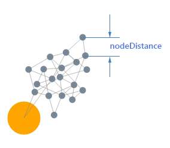

# Force-directed

**RadDiagram** supports force layout algorithm which is explained in this article.

## "Force" Layout Type

The Force-directed layout algorithm (also known as the spring-embedded algorithm) is based on a physical simulation of forces acting on the nodes whereby the links define whether two nodes act upon each other. Each link effectively is like a spring embedded in the diagram. The simulation attempts to find a minimum energy state in such a way that the springsare in their base-state and thus do not pull or push any (linked) node. This force-directed layout is **non-deterministic**; each layout pass will result in an	unpredictable (and hence not reproducible) layout. The optimal length is more and indication in the algorithm than a guarantee that all nodes will be at this distance. The result of	the layout is really a combination of the incidence structure of the diagram, the initial topology (positions of the nodes) and the number of iterations.

>caption **Figure 1**: Force-directed Layout

## Force Layout Specific Subtypes

RadDiagram does not offer any force-directed specific subtypes. The result of this layout depends on the values configured to the LayoutSettings’ **Iterations** and **NodeDistance** properties. You can find information about these properties in the [Layout Basics]()	article.

# See Also

 * [ASP.NET Diagram Control Product Overview]()

 * [RadDiagram Layout Basics]()
