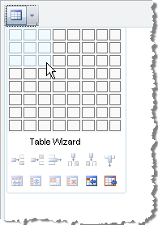
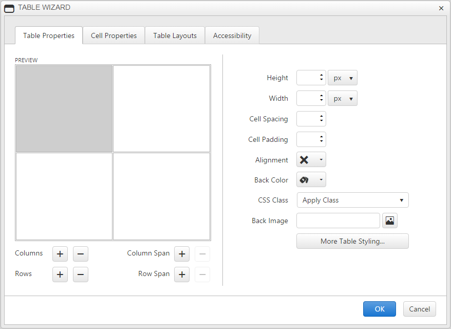
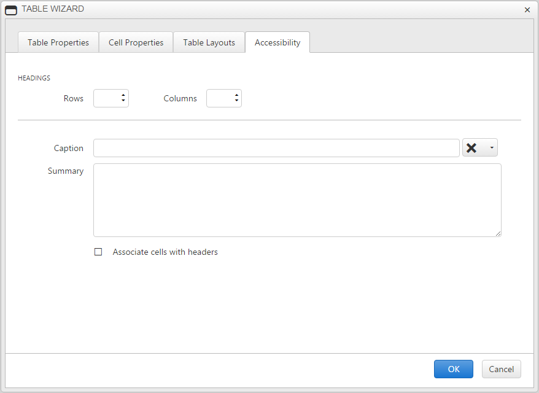

# Insert Table

RadEditor offers two ways for creating tables. The best approach depends on your preferences and the table complexity:

* For simple tables we recommend the click-and-drag Table Builder 

* For more complex tables, the Table Wizard is more appropriate.

## Table Wizard

The Table Wizard provides advanced features for creating and customizing tables in the editor's content area. The Table Wizard is a dialog with tabs for detailed table design: **Table Properties, Cell Properties and Accessibility**. The Table Wizard can be invoked using the **Insert Table Dropdown**.

## Table Properties

This tab allows you to adjust the number of rows and columns as well as adjust the row and column span. You can also configure table dimensions and layout by setting one or more of the following table properties:

This tab allows you to adjust the number of rows and columns as well as adjust the row and column span. You can also configure table dimensions and layout by setting one or more of the following table properties:

* **Width/Height** - Specifies the height and the width of the table (in pixels or percent).

* **Cell spacing** - Increases or decreases the space between the borders of the cells.

* **Cell padding** - Increases or decreases the space between the content and the border of a cell.

* **Alignment** - Aligns the table to the left, center or right side of the page.

* **Back Color** - Sets the background color of the table.

* **CSS Class** - Styles the entire table by using a predefined layout. For more information see the [Table Properties CSS Class Layout toolOnline Demo](https://demos.telerik.com/aspnet-ajax/editor/examples/tablelayoutcssfile/defaultcs.aspx).

* **Back Image** - Sets an image as the table background.

* **More Table Styling** - Open the style builder dialog.

## Cell Properties

The Cell Properties tab allows you to fine-tune the appearance of individual cells of a given table. Here you can configure cell width, height, alignment, background, the cell ID, toggle text wrapping and set the CSS class for a given cell.

## Accessibility

The Accessibility tab allows you to adjust the number of heading rows and columns, add caption settings, add a summary and to toggle if the cells are associated with the headers.

## Table Layouts

You can select a particular predefined layout for the table an apply special formats to the heading/last row and first/last column. 

## Table Tools

The Insert Table dropdown includes tools for setting alignment and borders.

1. Insert Row Above

1. Insert Row Below

1. Delete Row

1. Insert Column to the Left

1. Insert Column to the Right

1. Delete Column

1. Merge Cells Horizontally

1. Merge Cells Vertically

1. Split Cell

1. Delete Cell

1. Set Cell Properties

1. Set Table Properties
