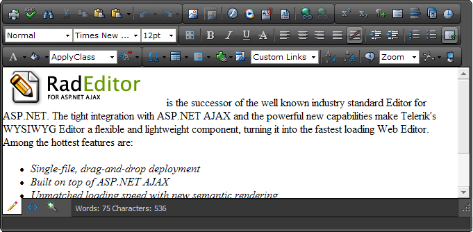

# Editor Overview

Thank you for choosing **Telerik RadEditor for ASP.NET AJAX! RadEditor for ASP.NET AJAX** is the successor for the well-known industry standard Editor for ASP.NET. The tight integration with ASP.NET AJAX and powerful new capabilities of the suite features the new WYSIWYG Editor as a flexible and lightweight component, turning it into the fastest loading Web Editor. 

#### Hottest Key features

* Unmatched loading speed

* Minimal script size

* New semantic rendering

* [Out-of-the-box XHTML-enabled output]()

* [Anti XSS functionality](https://docs.telerik.com/devtools/aspnet-ajax/controls/editor/managing-content/prevent-cross-site-scripting-(xss))

* Industry-best cross-browser support

* [Single-file, drag-and-drop deployment]() (all editor resources, including the dialogs reside in the same DLL)

* Multilevel undo/redo with action trails

* [7 ways to paste from Word]()

* [AJAX-based file browser dialogs]()

* [Full keyboard accessibility]()

* [Flexible skinning mechanism]()

* [Simplified and intuitive toolbar configuration]()

* Ability to have editors with different skins on the same page

* [Mobile Support and UI]()


#### Get started with the RadEditor

To test it by your own and see its benefits in practice you can start a free trial using the button below

<div class="justify-content-center text-center try-button">
    <a class="button" href="https://www.telerik.com/download-trial-file/v2-b/ui-for-asp.net-ajax" target="_blank">Start a free trial</a>
</div>

<style>
.try-button {
    margin-top: 3rem;
    margin-bottom: 3rem;
}
.try-button .button {
    display: inline-block;
    font-size: 18px;
    color: #ffffff;
    background-color: #378306;
    border-radius: 2px;
    transition: color .2s ease,background-color .2s ease;
    text-decoration: none;
    padding: 10px 30px 10px 30px;
    line-height: 1.5em;
    height: auto;
}

.try-button .button:hover {
    color: #ffffff;
    background-color: #47a336;
}
</style>


>caption To create a basic `RadEditor`:

1. ensure you have a script manager on the page (use \<asp:ScriptManager> tag to declare one)
1. use the \<telerik:RadEditor> tag to declare the editor and to set some of its properties

>caption Get started with the editor declaration and enabling some of its features

````ASP.NET
<telerik:RadEditor RenderMode="Lightweight" ID="RadEditor1" runat="server" ContentAreaMode="div" Width="500" Height="500" Skin="Black">
   <Content>
	 <b>Setting inline properties</b>
   </Content>
</telerik:RadEditor> 
````




## See Also

 * [Overview]()

 * [RadEditor Structure]()

 * [Set Properties]()

 * [WCAG 2.0 and Section 508 Accessibility Compliance]()

 * [XHTML Compliance]()


 
 
 
