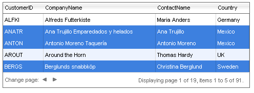
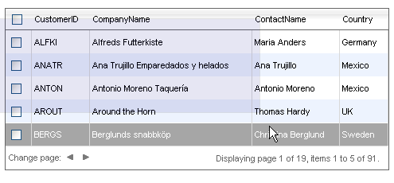

# Client-side Selecting Multiple Rows


## 

**RadGrid** allows users to select several rows at a time. By default, only one row can be selected at a time. To enable multi-row selection, set the grid's **AllowMultiRowSelection** property to **True**.

When multi-row selection is enabled, clicking on a row still de-selects any other selected rows. Users can select multiple rows by holding the **Ctrl** key down while clicking on a row:



By holding the **Shift** key down while clicking, the grid selects all rows between the last selected row and the current click:


Another way users can select multiple rows is by dragging around a set of rows. To enable this option, set the **ClientSettings.Selecting.EnableDragToSelectRows** property to **True:**



>caution When using the drag functionality to select multiple RadGrid rows, it is highly recommended to set the **margin** style of the **\<form\>** HTML element to **zero** . Otherwise a scrollbar flicker occurs during the selection in IE7 due to a browser-specific behavior.
> **CSS** 
>form{ margin: 0;}
>


When multi-row selection is enabled, if you add a **GridClientSelectColumn** to the grid, the header for the column contains a check box that selects or de-selects all items in the grid:


The selected items can be accessed by calling the **get_selectedItems()** method of the **GridTableView** client-side object (see the **Client-side API Reference** section for more information).

You can set the properties for enabling client-side multi-row selection declaratively:

````ASP.NET
	  <telerik:RadGrid RenderMode="Lightweight" ID="RadGrid1" runat="server" DataSourceID="SqlDataSource1" AllowMultiRowSelection="True">
	    <ClientSettings>
	      <Selecting AllowRowSelect="true" EnableDragToSelectRows="true" />
	    </ClientSettings>
	  </telerik:RadGrid>
````


You can also set these properties at runtime in the code-behind:


````C#
	    RadGrid1.AllowMultiRowSelection = true;
	    RadGrid1.ClientSettings.Selecting.AllowRowSelect = true;
	    RadGrid1.ClientSettings.Selecting.EnableDragToSelectRows = true;			
````
````VB
	RadGrid1.AllowMultiRowSelection = true
	RadGrid1.ClientSettings.Selecting.AllowRowSelect = true
	RadGrid1.ClientSettings.Selecting.EnableDragToSelectRows = true
````


For a live example that demonstrates client-side multi-row selection, see [ Client-side row selection](https://demos.telerik.com/aspnet-ajax/Grid/Examples/Client/Selecting/DefaultCS.aspx).
