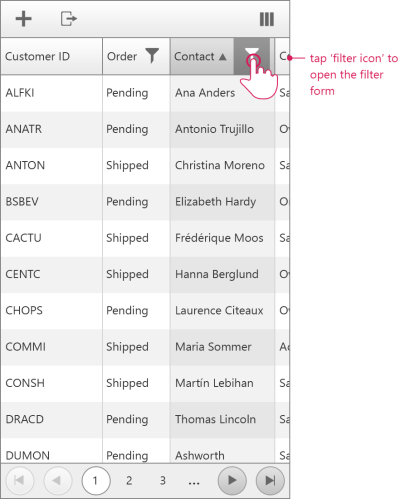
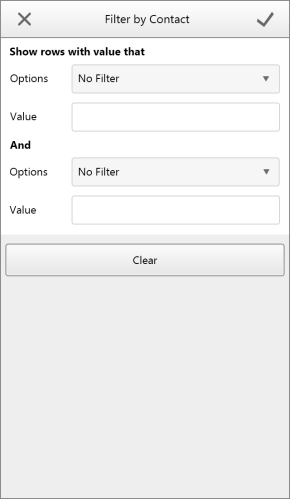

# Filtering

## 

When the active **RenderMode** of the **RadGrid** is set to **Mobile**, its filtering layout and user interaction will differ from that of its standard interface. This is done to optimize the user convenience when the page is accessed via a mobile or tablet device.

## Default Filtering

In the **Mobile** filtering version of RadGrid, the regular auto-generated textboxes are replaced with an appropriate filter form,which can be used to type in the desired filtering criteria. To enable this functionality, you have to set the **AllowFilteringByColumn** property of the corresponding GridTableView to **True**.

**Basic RadGrid in Mobile mode**

Once the filter item is visible, you can use the generated buttons to move into filter form.

**Filter Form**

The filter form can be thereby opened and the user may enter their custom filtering dependencies.

**Records filtered by the Order field**

## Context Filter Menu

There is also an alternative way to open the filter form. When the **EnableHeaderContextMenu** property is enabled, you will also need to set the **EnableHeaderContextFilterMenu** to **True** in order for the filtering to appear in the context menu options.

## See Also

 * [Overview]()
