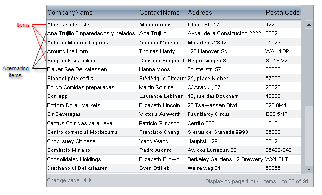
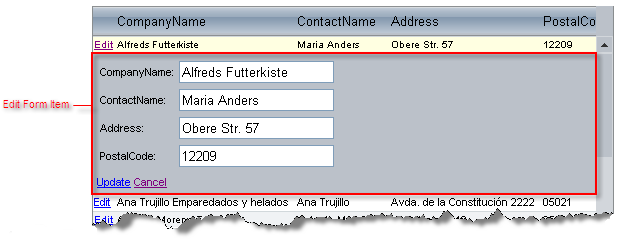
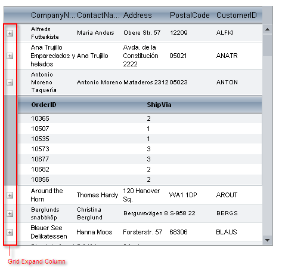
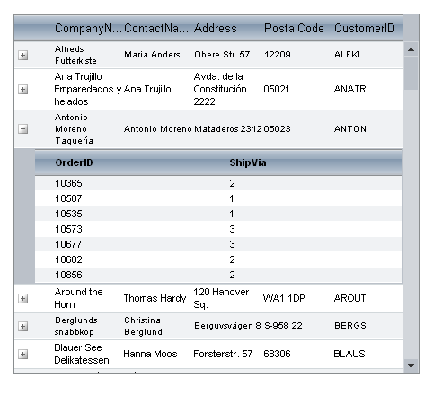
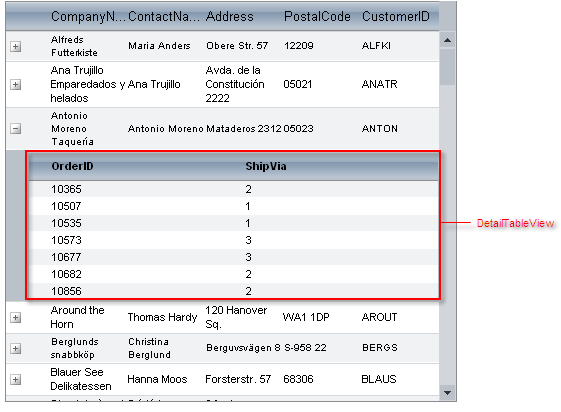
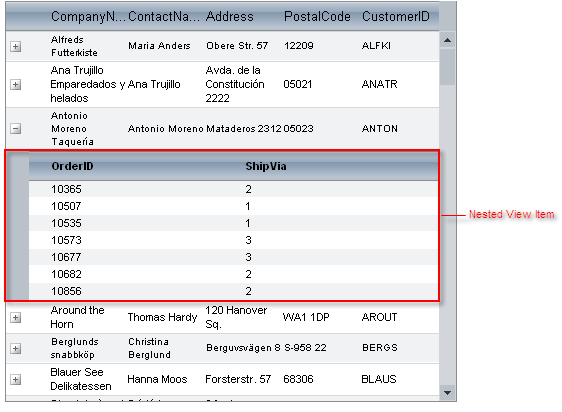
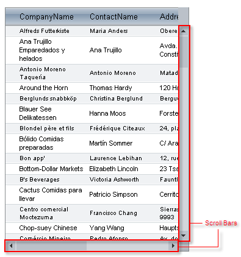
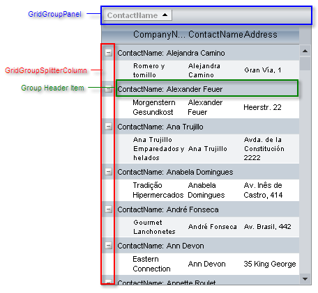
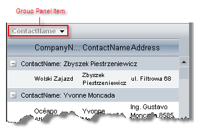

# RadGrid Structure Overview

Every item in RadGrid such as the Header, Filter, Row, etc... inherits the GridItem class and can be accesses using the GetItems() method of the GridTableView object.


# Grid Item Types

Below you will find an example describing each item type in the Grid and how to access it.

## GridDataItem

The rows of the grid are called **Items**.



Each item is a **GridDataItem** object. They can be accessed using the **Items** property collection of the **RadGrid** or **GridTableView** object.

````C#
protected void Page_PreRender(object sender, EventArgs e)
{
    foreach (GridDataItem dataItem in RadGrid1.Items)
    {

    }
    foreach (GridDataItem dataItem in RadGrid1.MasterTableView.Items)
    {

    }
}
````

If the grid uses a separate appearance for odd- and even-numbered rows, the even-numbered rows are called **AlternatingItems**. This is defined in the **GridDataItem.ItemType** property.  The value of **Items** is "Item" and for **AlternatingItems** it is "AlternatingItem". They both can be accessed separately by using the GetItems() method of the GridTableView object.

````C#
protected void Page_PreRender(object sender, EventArgs e)
{
    foreach (GridDataItem item in RadGrid1.MasterTableView.GetItems(GridItemType.Item))
    {

    }

    foreach (GridDataItem alternatingItem in RadGrid1.MasterTableView.GetItems(GridItemType.AlternatingItem))
    {

    }
}
````


If there are no records to display in the grid, it displays a **GridDataItem** of type "NoRecordsItem":


This can be accessed as:

````C#
protected void Page_PreRender(object sender, EventArgs e)
{
    GridNoRecordsItem noRecordsItem = RadGrid1.MasterTableView.GetItems(GridItemType.NoRecordsItem)[0] as GridNoRecordsItem;
}
````

## GridHeaderItem

The header appears above the rows, and are of type **GridHeaderItem** object:


Accessing the Header Item

````C#
protected void Page_PreRender(object sender, EventArgs e)
{
    GridHeaderItem headerItem = RadGrid1.MasterTableView.GetItems(GridItemType.Header)[0] as GridHeaderItem;
}
````


You can hide or show the header element using the grid's **ShowHeader** property. For more information about headers, see [Using columns]().

## GridFooterItem

The footer appears below the rows, and is represented by the **GridFooterItem** object:


You can hide or show the footer using the grid's **ShowFooter** property. For more information about footers, see [Using columns]().

## GridFilteringItem

The grid filtering item appears when you have [Filtering ]() enabled either by **RadGrid.AllowFilteringByColumn** or **GridTableView.AllowFilteringByColumn** properties:


## GridEditFormItem

The edit form item nests the edit form that shows controls for item editing:



For information about edit forms, see [Edit forms]().

## GridPagerItem

If paging is enabled, **RadGrid** renders a pager item (**GridPagerItem**) on the top and/or bottom of of the grid table view:


For information about **GridPagerItem**, see [Pager item]().

## GridCommandItem

You can add a command item (**GridCommandItem**) to the grid for displaying function buttons.


The **GridCommandItem** object can appear at the top, bottom or top and bottom of the grid. You can specify the content of the command item using a template. **GridCommandItem** is commonly used for automatic database operations, but it can be used for executing any **RadGrid** commands. For more information, see [Command Item]().

## GridRowIndicatorColumn

When row resizing is enabled, **RadGrid** automatically generates a column of type **GridRowIndicatorColumn**.


For information about resizable rows, see [Resizing rows]().

## GridBoundColumn

If the grid auto-generates its columns (the **AutoGenerateColumns** property is **True**), the grid generates **GridBoundColumn** objects for each column that displays data:


You can also explicitly add columns to the grid of other types. For details, see [Column types]().

## GridExpandColumn

The **GridExpandColumn** is an automatically generated and automatically placed column that appears when the grid has a hierarchical structure:



The expand column holds the expand and collapse buttons that show or hide detail tables. It is always placed in front of all other grid content columns and cannot be moved.

>note You can manually add additional instances of this type of column.
>


## MasterTableView

The **MasterTableView** is the **GridTableView** object for the topmost table in the hierarchical structure:



The **MasterTableView** contains all inner tables (**DetailTables**), which are available on demand (see [Hierarchy Load]()). When there is no hierarchical structure, the **MasterTableView** coincides with **RadGrid** itself.

For more information about the relationship between the **MasterTableView** and the grid, see [RadGrid and MasterTableView difference]().

## DetailTableView

The **DetailTableView** is the **GridTableView** object for an inner table of a hierarchical structure:



Detail table views can be nested inside a **MasterTableView**, or inside another Detail table view (when the hierarchy includes multiple levels).

## NestedViewItem

Nested view items are **Items** of a parent table that contain a nested **DetailTableView**.



Each nested view item contains only a single **GridTableView**. If a master table has more than one detail table, each detail table has its own nested view item.

## ScrollBars

Scroll bars appear when the [ scrolling is enabled]() and the grid cannot display all of its rows or the width of a **GridTableView** exceeds the width of the item in which it is nested (or, in the case of the MasterTableView, the width of the grid).



By default, scrolling is not enabled.

## Grouping elements

When you set the grid's **GroupingEnabled** property to **True**, a number of grouping elements are automatically generated and added to the grid:



The **GridGroupSplitterColumn** appears on the far left of each **GridTableView**, and enables users to expand and collapse groups of records. The group splitter column is always placed first and cannot be moved. For more information about the **GridGroupSplitterColumn**, see [Column types]().

Each group of records in a **GridTableView** is preceded by a **GroupHeaderItem**, which indicates the grouping field.

The **GridGroupPanel** is added to the top of the grid. This panel acts as a repository for panel items, which represent the columns on all table views in the grid that are used for grouping. You can optionally hide the **GridGroupPanel** using the grid's **ShowGroupPanel** property. You can access the panel using the grid's GroupPanel property.

For more information on grouping, see [Basic grouping]().

## Panel Items

Each Panel item represents a column in one of the table views that the grid displays. Users can click on the panel items to change the sort direction of the corresponding group, drag items off the Grid group panel to remove grouping on that field, and drag header cells to the group panel to add new panel items (and corresponding groups).


