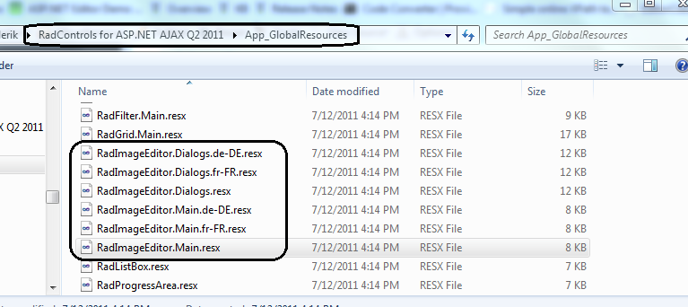
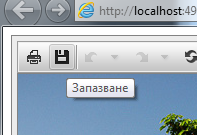

# Localization

## Localization Overview

**RadImageEditor** is fully localized using Global resources. The control comes with three built-in language packs, English, German and French, between you can easily switch be setting the **Language** property or setting **UICulture** property to the @Page directive. The **Language** property is with higher priority than the global **UICulture** setting.

Similar to **RadGrid**, **RadEditor** and **RadScheduler**, you can use resx files to localize (or customize) the control’s localization strings with minimum efforts. The Telerik® UI for ASP.NET AJAX suite’s installation wizard copies the built-in resource files in the **App_GlobalResources** folder in your local installation.

You can either create your own language pack or use an existing one (if available for your language).

## Create New Language

The following steps demonstrate how to create a new language pack for **RadImageEditor**.

1. Add **App_GlobalResources** folder to the application folder (if it does not already exists).

1. Copy **RadImageEditor.Main.resx** and **RadImageEditor.Dialogs.resx** files to **App_GlobalResources** folder.

1. Create another copies of the above files and name them according to the new language’s culture. **RadImageEditor.Main.[your_language].resx** and **RadImageEditorDialogs.[your_language].resx**.

	>note Please note that you need to keep the original files in the folder as well

1. Open the newly copied language specific resource file and modify the keys’ values

	

	>caution Please do not modify/remove the ReservedResource key.

1. Set the RadImageEditor’s Language property to the corresponding language:

	**ASP.NET**

		<telerik:RadImageEditor RenderMode="Lightweight" runat="server" ID="RadImageEditor1" Language="bg-BG">
		</telerik:RadImageEditor>

	**C#**

		RadImageEditor1.Language = "bg-BG";

	**VB**

		RadImageEditor1.Language = "bg-BG"

1. When you run the application, the new resources will be recognized and the corresponding hints or other UI elements will display in the new language:

	
