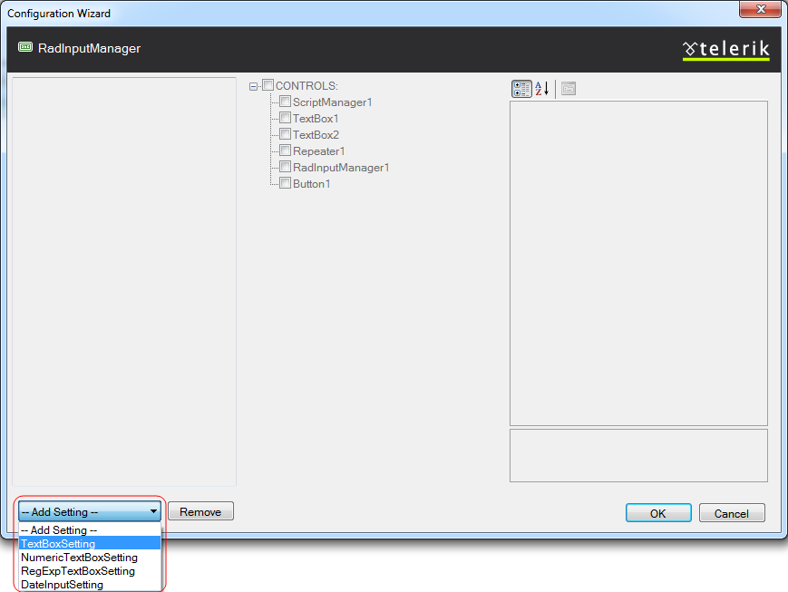
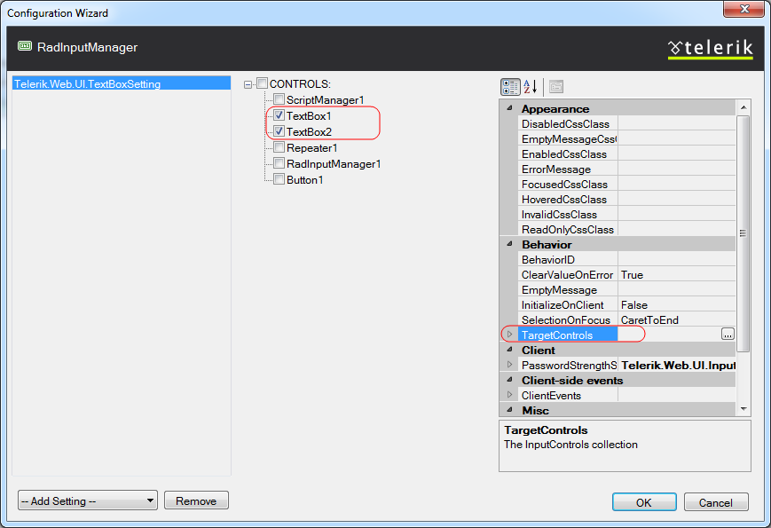

# Design Time

## 

The first option for design time settings is one which is also available for all other controls, namely, setting a skin. Once you open the SmartTag, there is a drop down from which you can select from a set of predefined skins. This is demonstrated in the screen shot below:

The next important aspect of the design time support for the control is the ability to configure it to determine which controls on the page will be extended through it. Essentially, the approach is similar to the one used to Ajax-enable controls on the page via the RadAjaxManager. First, you select what type of setting you will be adding – TextBoxSetting/NumericTextBoxSetting/RegExpTextBoxSetting/DateInputSetting.

Once you have chosen one of the four possible options, you can choose which particular controls on the page you would like to extend – the right-hand side pane lists all the controls on the current page.

Once you have chosen the setting, and the controls to be extended, you can set some of the most important properties of each setting, as shown in the screen shot below:

The properties which can be set include css classes for the different states (hover/enabled, etc), behavior settings such as BehaviorID and EmptyMessage, as well as the client-side events (OnBlur, OnError, OnFocus, OnKeyPress).
