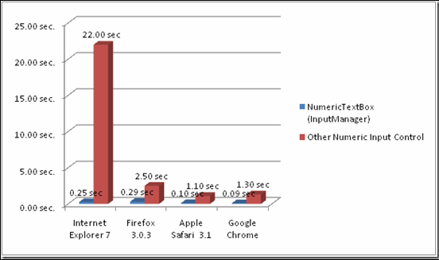
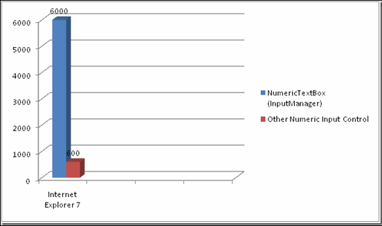

# Performance

## 

The following topic will briefly explain some of the performance benefits which the **RadInputManager** control has.

The first performance benefit is related to the loading time of a large number of input controls on the page. Usually, having a large number of input controls on the page, each associated with a separate object and client events and handlers, would imply a performance hit. Introducing the **RadInputManager**, however, dramatically reduces the load time. The chart which follows demonstrates the loading time of a standard page, with a total of 300 input controls on one hand, compared to the extension of 300 text box controls.

Another aspect of performance is the maximum number of controls allowed on the page. Local tests showed that a standard application would allow no more than 600 input controls on the page. With the help of **RadInputManager**, however, this number can be increased ten times, to a total of 6000 extended controls, as shown in the chart below:

Yet another aspect of performance is the footprint of the page. Local tests showed that a standard page, with a total of 300 input controls, generates a footprint of approximately 400KB. On the other hand, extending 300 standard text boxes via the **RadInputManager**, to enhance their behavior to a NumericInput control, generates a footprint of approximately 100KB. This brings about faster loading and better responsiveness of the page.

The core of the performance benefit of using a RadInputManager as opposed to input controls, is in the following approach. A normal input control generates a client side object for each control instance. For example, if you declare 300 input controls on the page, you will have 300 client objects, once the page is compiled and ran. On the other hand, when extending standard text boxes, via the **RadInputManager** control, you will have a single client side object, which would dramatically improve performance, while at the same time providing enhanced data entry capabilities for user input validation.
