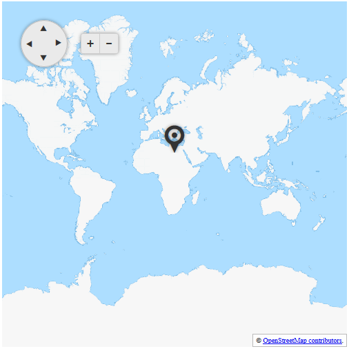
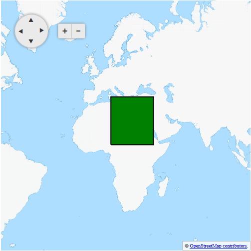
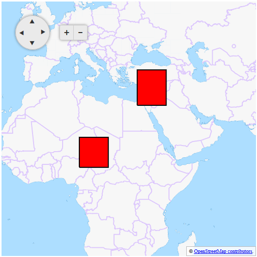

# Show and Hide Layers According to Zoom Level

In the example below you can see how to configure layers to show and hide on based on the zoom level. 

The example uses the `MinZoom` and `MaxZoom` properties of the **MapLayer** class.

In the figures below you can see the result of the code from **Example 1**.

>caption Figure 1: RadMap with zoom level 1



>caption Figure 2: RadMap with zoom level 2



>caption Figure 3: RadMap with zoom level 3




>caption Example 1: Configuring layer clustering on zoom level in RadMap

````ASP.NET
<telerik:RadMap RenderMode="Lightweight" runat="server" ID="RadMap1" Zoom="1" Width="500" Height="500">
    <ClientEvents OnInitialize="OnInitialize" />
    <CenterSettings Latitude="25" Longitude="25" />
    <LayersCollection>
        <telerik:MapLayer Type="Tile" Subdomains="a,b,c"
            UrlTemplate="http://#= subdomain #.tile2.opencyclemap.org/transport/#= zoom #/#= x #/#= y #.png"
            Attribution="&copy; <a href='https://osm.org/copyright' title='OpenStreetMap contributors' target='_blank'>OpenStreetMap contributors</a>.">
        </telerik:MapLayer>
        <telerik:MapLayer Type="Marker" MaxZoom="1">
        </telerik:MapLayer>
        <telerik:MapLayer Type="Shape" MaxZoom="2" MinZoom="2">
            <StyleSettings>
                <FillSettings Color="green" />
                <StrokeSettings Color="black" Width="2" />
            </StyleSettings>
        </telerik:MapLayer>
        <telerik:MapLayer Type="Shape" MinZoom="3">
            <StyleSettings>
                <FillSettings Color="red" />
                <StrokeSettings Color="black" Width="2" />
            </StyleSettings>
        </telerik:MapLayer>
    </LayersCollection>
</telerik:RadMap>

<script type="text/javascript">
    var shapeData1 = [{
        "type": "Polygon",
        "coordinates": [
            [[10, 10], [10, 40], [40, 40], [40, 10], [10, 10]]
        ]
    }];

    var shapeData2 = [{
        "type": "Polygon",
        "coordinates": [
            [[10, 10], [10, 20], [20, 20], [20, 10], [10, 10]]
        ]
    }, {
        "type": "Polygon",
        "coordinates": [
            [[30, 30], [30, 40], [40, 40], [40, 30], [30, 30]]
        ]
    }];

    var markerData = [{
        "location": [25, 25],
    }];

    function OnInitialize(sender, args) {
        var originalOptions = args.get_options();

        originalOptions.layers[1].dataSource = { data: markerData };
        originalOptions.layers[2].dataSource = { data: shapeData1 };
        originalOptions.layers[3].dataSource = { data: shapeData2 };

        args.set_options(originalOptions);
    }
</script>
```` 

## See Also

* [Tile Layers]()
* [Markers]()
* [Shapes]()


