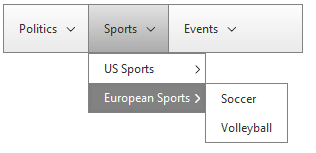
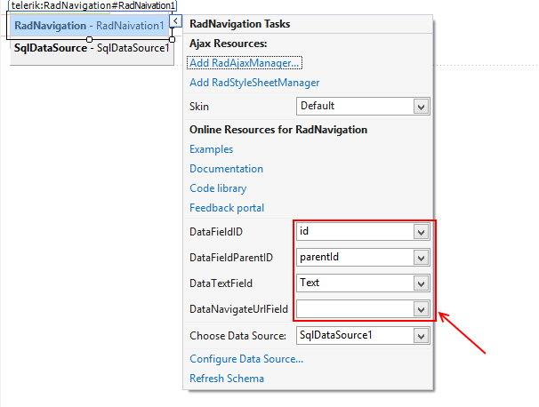

# Getting Started 


## 

The following tutorial demonstrates how you can add **RadNavigation** bound to SqlDataSource control with three steps. The end result will be similar to **Figure 1**:
>caption Figure 1: RadNavigation bound to SqlDataSourcecontrol



1. Add a **ScriptManager** control on a Web Form.

1. Add a **RadNavigation** control on the Web Form:**Example 1**: Basic declaration of a **RadNavigation** control:

````ASPNET
<telerik:RadScriptManager ID="RadScriptManager2" runat="server"></telerik:RadScriptManager>
<telerik:RadNavigation runat="server" ID="RadNavigation1"></telerik:RadNavigation>
````

1. Use the SmartTag of the **RadNavigation** to assign SqlDataSource:

1. Use the Data Source Configuration Wizard to assign the DataSource and the preferable fields:

1. Assign the fields from the DataSource to the corresponding properties of the RadNavigation:
