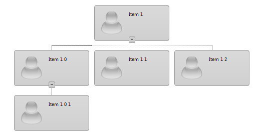
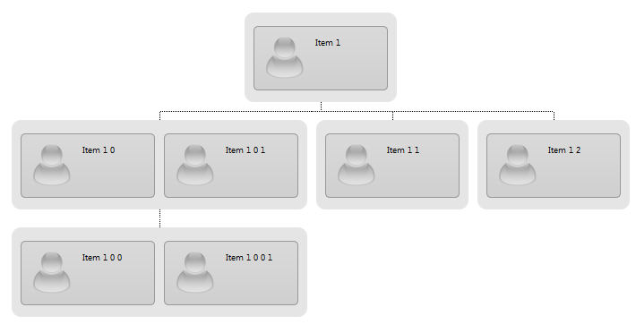
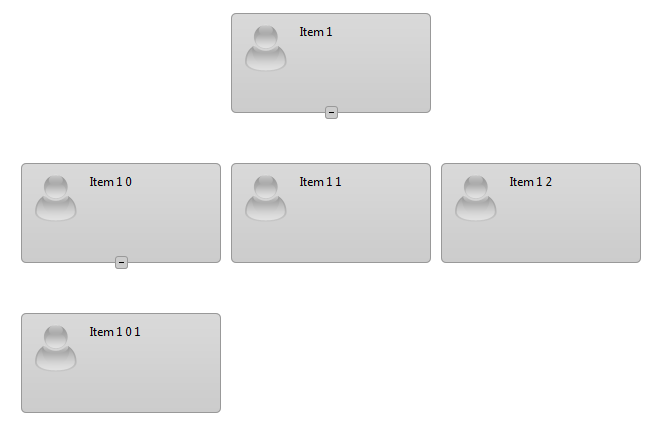

# Connecting Lines


## How to change the style of the connecting lines?

In case you would like to change the length of the connecting lines you can add styles as in the following code:

````ASPNET
  html .RadOrgChart .rocLineUp
{
	height:10px ;
	top: -10px;
}

html .RadOrgChart .rocLineDown
{
	height:10px;

}
html .RadOrgChart .rocLineHorizontal
{
	top: -10px;
}

html .RadOrgChart .rocNodeList
{
	margin: 20px auto 0;
}

.rocItem
{
	width:150px!important;
	height:70px!important;
}

.rocItemContent
{
	height:50px!important;
	font-size: 10px;
}
````



If you want to make the lines **invisible** you can use the code below:

````ASPNET
 .rocLineHorizontal, .rocLineUp, .rocLineDown
{
    visibility:hidden;
}
````



If you want to add arrows to the ends of the connecting lines you can add the following css styles:

````ASPNET
.rocLineUp:after 
{
    content: "";
    width: 9px;
    height: 5px;
    background: url("rocDownArrow.gif") no-repeat center center;
    position: absolute;
    bottom: 0;
    left: -4px;
}
	  
````


Such implementation is not supported in IE6 and IE7 browsers because they do not implement the **":after"** css selector.


## Modify connection lines in exported PDF file

The **RadClientExportManager** can be used to easily export the **RadOrgChart** to a PDF file as demonstrated in the [OrgChart - Export to PDF](https://demos.telerik.com/aspnet-ajax/client-export-manager/applicationscenarios/export-radorgchart/defaultcs.aspx?product=orgchart) online demo. 

Due to a technical limitaion, the ClientExportManager cannot export the *:before* and *:after* pseudo elements that are actually the connecting lines of the RadOrgChart with Lightweight RenderMode. 

Nevertheless, this issue is workarounded as of R2 2020, and for previous versions, the following CSS style can be used:

````CSS
.RadOrgChart .kendo-pdf-hide-pseudo-elements:after,
.RadOrgChart .kendo-pdf-hide-pseudo-elements:before {
  display: none !important; }

.k-pdf-export .rocNode:before {
  display: normal;
  height: 0.3px;
  max-width: 100%;
  background: black; }

.k-pdf-export .rocGroup:before,
.k-pdf-export .rocGroup:after,
.k-pdf-export .rocNode:after,
.k-pdf-export .rocItem:after {
  display: normal;
  max-height: 100%;
  width: 0.3px;
  background: black; }

.k-pdf-export .RadOrgChart.rocHorizontal .rocNode:before,
.k-pdf-export.RadOrgChart.rocHorizontal .rocNode:before {
  width: 0.3px; }

.k-pdf-export.RadOrgChart.rocHorizontal .rocGroup:before,
.k-pdf-export.RadOrgChart.rocHorizontal .rocGroup:after,
.k-pdf-export.RadOrgChart.rocHorizontal .rocNode:after,
.k-pdf-export.RadOrgChart.rocHorizontal .rocItem:after,
.k-pdf-export .RadOrgChart.rocHorizontal .rocGroup:before,
.k-pdf-export .RadOrgChart.rocHorizontal .rocGroup:after,
.k-pdf-export .RadOrgChart.rocHorizontal .rocNode:after,
.k-pdf-export .RadOrgChart.rocHorizontal .rocItem:after {
  display: normal;
  border-top: 0.3px solid black !important;
  max-width: 100%;
  height: 0.3px; }
````

