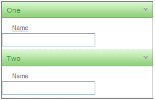
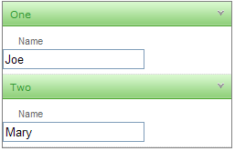

# DataBinding Expressions


## 

Sometimes, when you use Item or Content templates, you want the controls in the template to display information associated with the panel item properties. For example, consider a simple panel bar with a text box in the item templates of child items:

>note Please note that the approach that follows is valid for Content Templates as well.
>


````ASPNET
<telerik:radpanelbar id="RadPanelBar1" runat="server" skin="Telerik">  
<Items>    
    <telerik:RadPanelItem runat="server" Text="One">      
    <Items>        
        <telerik:RadPanelItem runat="server" Text="Name" Value="Joe">          
            <ItemTemplate>            
               <asp:TextBox ID="TextBox1" runat="server" />          
            </ItemTemplate>       
        </telerik:RadPanelItem>       
        </Items>     
        </telerik:RadPanelItem>     
        <telerik:RadPanelItem runat="server" Text="Two">       
        <Items>         
        <telerik:RadPanelItem runat="server" Text="Name" Value="Mary">           
        <ItemTemplate>              
           <asp:TextBox ID="TextBox2" runat="server" />           
        </ItemTemplate>         
        </telerik:RadPanelItem>       
    </Items>     
    </telerik:RadPanelItem>  
</Items>
</telerik:radpanelbar>
````


When you run the application, the panel items all show empty text boxes:



This is good as far as it goes, but perhaps you want to initialize the values of the text boxes. Note that the **Value** property of the panel items has a name all ready to assign.To override the **Text** property of the text box in the template, use a **DataBinder.Eval** statement:

````ASPNET
<itemtemplate>    
     <asp:TextBox ID="TextBox1" runat="server" Text='<%# DataBinder.Eval(Container, "Value") %>'/>
</itemtemplate>
````


In the DataBinder.Eval statement, **Container** is the **RadPanelItem** and **"Value"** identifies the **Value** property of that item.

>note In this example, the first parameter to the DataBinder.Eval statement is **Container** , because the items are statically bound. If the panel bar was bound to a data source, then you must use **Container.DataItem** instead. e.g.<%#DataBinder.Eval(Container.DataItem, "TextField") %>
>


In addition to adding a DataBinder.Eval statement, you must also explicitly call the DataBind method for the items so that the template has access to the **Value** property:


````C#
		
protected void Page_Load(object sender, EventArgs e)
{
    if (!IsPostBack) 
    { 
        for (int i = 0; i < RadPanelBar1.Items.Count; i++)      
        RadPanelBar1.Items[i].DataBind(); 
    }
}
	
````
````VB.NET
		
Protected Sub Page_Load(ByVal sender As Object, ByVal e As EventArgs) Handles Me.Load
    If Not IsPostBack Then
        Dim i As Integer = 0
        While i < RadPanelBar1.Items.Count
            RadPanelBar1.Items(i).DataBind()
            i = i + 1
        End While
    End If
End Sub
	
````


Now the value of the panel items appears in the text boxes:



# See Also

 * [Data Binding Overview]()

 * [Templates Overview]()
