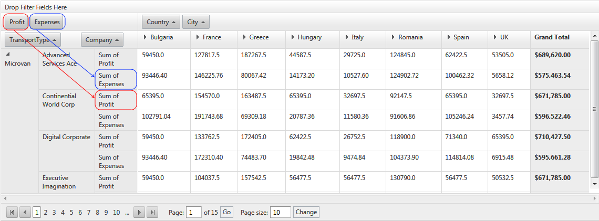

# Styling


## Styling Row/Column/Data table cells

Since Q3 2012 RadPivotGrid provides means to change how the columns, rows, and data cells looks.There are couple ways for changing the default style:

* Globally, through the **ColumnHeaderCellStyle**, **RowHeaderCellStyle**	and **DataCellStyle** properties of RadPivotGrid.


````ASPNET
<ColumnHeaderCellStyle Width="300px" />
<RowHeaderCellStyle Width="300p" />
<DataCellStyle Width="300px" />
````


* **ColumnHeaderCellStyle** – applies style to all pivotgrid’s column header table cells.

* **RowHeaderCellStyle** – applies style to all pivotgrid’s row header table cells.

* **DataCellStyle** – applies style to all pivotgrid’s data table cells.

* Or specifically for given field though the **CellStyle** property.


````ASPNET
<telerik:PivotGridRowField DataField="TransportType" CellStyle-ForeColor="Red" CellStyle-Font-Size="Small">
</telerik:PivotGridRowField>
````


## Cases and specifics

If CellStyle and a some header style(RowHeaderCellStyle, ColumnHeaderCellStyle, or DataCellStyle) are both set, the CellStyle property takes precedense. The possible scenarios are as follows:

* AggregatePosition="Columns"

* One aggregate field:


* Two or more aggregate fields:


* AggregatePosition="Rows"

* One aggregate field:


* Two or more aggregate fields:

