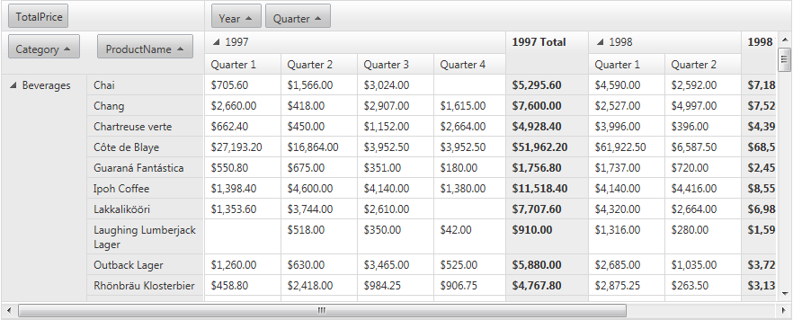

# Scrolling

When constructing a Web page that contains a RadPivotGrid, you may encounter a design limitations in case the RadPivotGrid has too many items. In such cases, you can easily make it scrollable by setting the **ClientSettings -> Scrolling -> AllowVerticalScroll** property to **True** (By default its value is **False**.) The Horizontal scroll is enabled by default and will appear when the total width of the columns exceeds the width of the RadPivotGrid.

The **ClientSettings->Scrolling->ScrollHeight** property specifies the height value beyond which scrolling is turned on. The default value is 300px.

The **ClientSettings->Scrolling->SaveScrollPosition** property keep the scroll position during postbacks.

When scrolling is enabled, scroll bars appear on the grid when the number of records it displays would cause it to exceed the value of **ScrollHeight**:

>note To optimize the RadPivotGrid loading time when scrolling is enabled, you may consider defining **ColumnHeaderCellStyle.Width** and **RowHeaderCellStyle.Height** properties. Thus the pivotgridwill not execute additional scripts for aligning.
>

