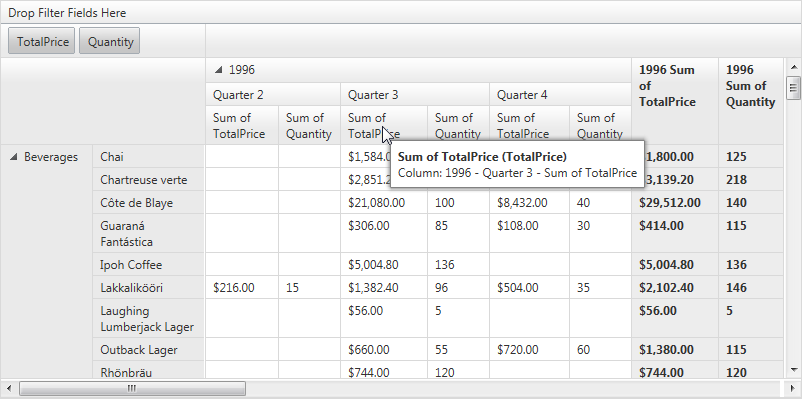

# Tooltips

The ToolTips feature of RadPivotGrid enables tooltips containing rich data	to be shown for different cells of the control.

## Structure

The structure of the data in the ToolTips follows the pattern used in Excel.ToolTips are shown for three different kinds of cells in the PivotGrid:

* **PivotGridDataCell:** The tooltips for the data cells contain the most data. It is structured in four rows:

* The first line is the title header of the column which is direct parent of the cell for which the tooltip is shown. (e.g. Sum of Total Price is also the name of the most inner cell in the column header).

* The second row is the actual value of the cell in the format: Value: <text>(note that formatting is preserved, in this case as currency $21,080.00).

* The third line contains a path formed from row header cells relevant to the datacell (e.g. in the current case there only two row header cells that define the data cell: Cote de Blaye and its parent Beverages). The format is: Row: Parent1 – Parent2 – Parent3 - …. Parent n

* The last fourth line contains the path formed by the column header cells which describe the datacell (consists of three column header cells: 1996, Quarter 3 and Sum of Total price). The format is Column: Parent1 – Parent2 – Parent3 - …. Parent n.

* **PivotGridRowHeaderCell:** The tooltips here contain only two lines:

* The first line consists of two parts. It starts with the text of the cell itself and the second part in the brackets represents the DataField which has given the value of the cell (in this case ProductName).

* The second line the row path containing all the titles of all ancestors of the cell in the row header cell tree.

* **PivotGridColumnHeaderCell:** The tooltips here are very similar in structure to the RowHeaderCell tooltips. Again we have:

* First line which shows the text and the datafield in brackets for the current cell.

* And second line which shows the path generated by all the ancestors of cell in the column header tree.

## Server-Side API

The following properties are available on the server:

* You can enable the tooltips through the **EnableToolTips** property of RadPivotGrid (default value false).

* **ToolTipManager** property of type RadToolTipManager. This allows you to apply and modify settings that will affect all the tooltips in the control and their internal generation. Use the tooltip manager reference with caution. Check the next section for information about the modifications which you should not make to it.

>note RadPivotGrid also has a string property called ToolTip. This is a default property inherited from WebControl and is not related in any way to the current ToolTips feature. As in every other web control this property simply renders a title attribute on the main HTML element of the control.
>

## How ToolTips work

RadPivotGrid uses a RadToolTip manager control to create tooltips. ToolTips are created dynamically on mouse move event client-side. For performance optimization only one instance of the client-side tooltip object is used – and its internal text is changed depending on the cell that is currently hovered.

To achieve proper showing and smooth performance the following settings in the RadToolTipManager are applied by default:

* **ID** = "PivotGridToolTipManager"

* **ShowDelay** = 450

* **ShowCallout** = false

* **Position** = ToolTipPosition.BottomRight

* **HideEvent** = ToolTipHideEvent.FromCode

>important We do not recommend changing the **HideEvent** property because internal showing and hiding of the tooltips depends on it. Also please do not set the ShowDelay property of the tooltip below 20ms because this can cause issues in some cases when the tooltip is dynamically shown.
>

All other properties of the ToolTipManager can be freely modified depending on your preferences.
