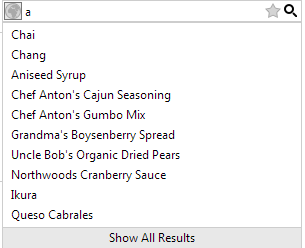

# SearchBox Overview

**Telerik RadSearchBox for ASP.NET AJAX** is a light control which provides the ability to write text in an input field with an optional autocomplete functionality or searching the plain result of the text written in it. The control has a property **EnableAutoComplete** that enables or disables the [AutoComplete feature](). It has a default [ “search” button ](), which triggers an event containing the typed value, as well as a [collection of additional image buttons](). Each of them is displayed inside the control and trigger an event when clicked.

The main purpose of the SearchBox is to provide a list of options from a large data set when you type text in the SearchBox input. You can see the following blog post on the matter: [Need to search in large datasets? Don’t worry, Telerik’s ASP.NET SearchBox control has got you covered](https://www.telerik.com/blogs/need-to-search-in-large-datasets-don-t-worry-telerik-s-asp.net-searchbox-control-has-got-you-covered).

RadSearchBox has a rich client-side API and a comprehensive set of events that guarantee full control over various scenarios on the client.

## Summary of features supported by RadSearchBox

* [ Default Search Button ]()

* [ Collection of image buttons. ]()

* [ AutoComplete ]() functionality. When the AutoComplete is enabled, the following features are available:

	* [DropDown Header/Footer Templates]()

	* [Client]() and [Server]() Templates

	* [Keyboard Navigation]()

	* [Filtering ]()- StartsWith or Contains

	* **MinFilterLength** - defines the minimum number of characters that must be typed before the autocomplete dropdown is shown. The default value is 1.

	* **MaxResultsCount** - defines how many results are shown in the dropdown.

* [ Search Context ]() functionality was added from Q2 2013 in order to provide context for the search operation.The search context is represented as a simple drop-down giving a choice to select a context item.This feature improves the performance and usability when searching in large data sets.

* **Data Binding**

	* [Array, ArrayList]()

	* [DataTable, DataSet, DataView]()

	* [ASP DataSource types]()

	* [Web Service]()

	* [WCF Service]()

	* [OData]()
	
	
# See Also
* [Need to search in large datasets? Don’t worry, Telerik’s ASP.NET SearchBox control has got you covered](https://www.telerik.com/blogs/need-to-search-in-large-datasets-don-t-worry-telerik-s-asp.net-searchbox-control-has-got-you-covered).

