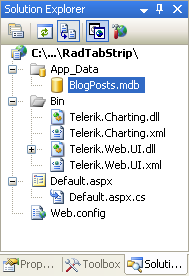
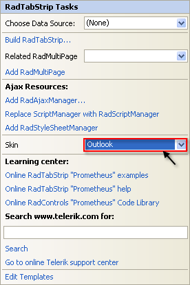
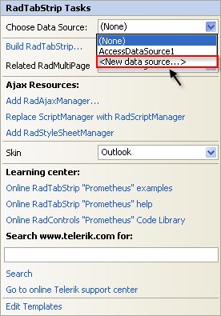
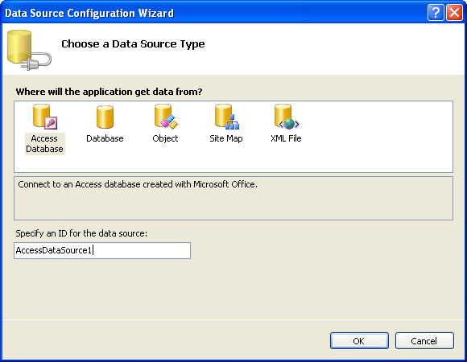
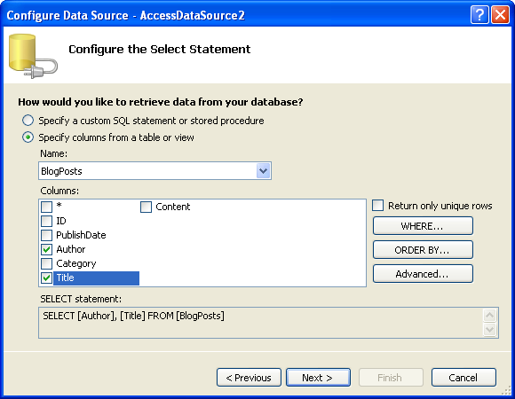
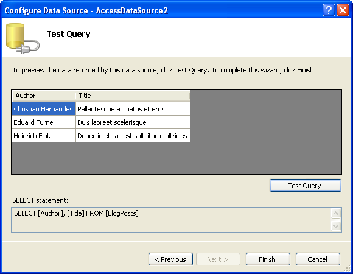
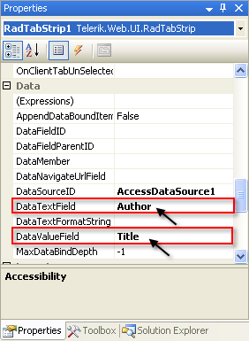

# Binding to a Data Source

## 

This tutorial will show how to bind **RadTabStrip** to an **AccessDataSource**:

1. Locate the file "BlogPosts.mdb" file that appears in the **Live Demos/App_Data** folder of your **RadControls for ASP.NET Ajax** installation. Drag this file to the **App_Data** folder in the Solution Explorer for your project:


1. Drag a **RadTabStrip** component from the toolbox onto your Web page. The **RadTabStrip** [Smart Tag]() should appear automatically:


1. In the **RadTabStrip** Smart Tag, use the **Skin** drop-down to change the [skin]() for the **RadTabStrip** to "Outlook":


1. Still in the Smart Tag, open the **Choose Data Source** drop-down and select **New Data Source**.


1. The Data Source Configuration Wizard appears. In the Select a DataSource Type screen, specify an **AccessDataSource** and click **OK.** 


1. In the **Choose a Database** screen, click the **Browse** button, and select the "BlogPosts.mdb" file. Then choose **Next** to continue:


1. In the **Configure the Select Statement** screen, choose **Specify columns from a table or view**, and select the "Author" and "Title" fields. Then choose **Next** to continue:


1. Click the Test Query button to see the data from the data source. Then choose Finish to exit the Wizard:


1. In the Properties pane for the **RadTabStrip** component:

1. Set the **DataTextField** property to "Author".

1. Set the **DataValueField** property to "Title".


1. Drag a **TextBox** control from the toolbox onto your Web page below the **RadTabStrip** control:

* Set the **BorderWidth** property to "0px".

* Set the **Width** property to "100%".

1. Add the following **TabClick** event handler to your **RadTabStrip** control so that the text box shows the value of a tab item when the user selects it:


````C#
protected void RadTabStrip1_TabClick(object sender, Telerik.Web.UI.RadTabStripEventArgs e)
{
 TextBox1.Text = e.Tab.Value;
} 				
````
````VB.NET
Protected Sub RadTabStrip1_TabClick(ByVal sender As Object, _
        ByVal e As Telerik.Web.UI.RadTabStripEventArgs) _
        Handles RadTabStrip1.TabClick
  TextBox1.Text = e.Tab.Value
End Sub  	
````


1. Run the application. Note that the tabs are labelled using the "Author" field of the data source. Click on a tab. Note that the text box displays the value of the "Title" field:


# See Also

 * [Overview]()

 * [Getting Started]()
