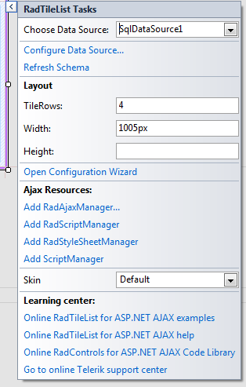
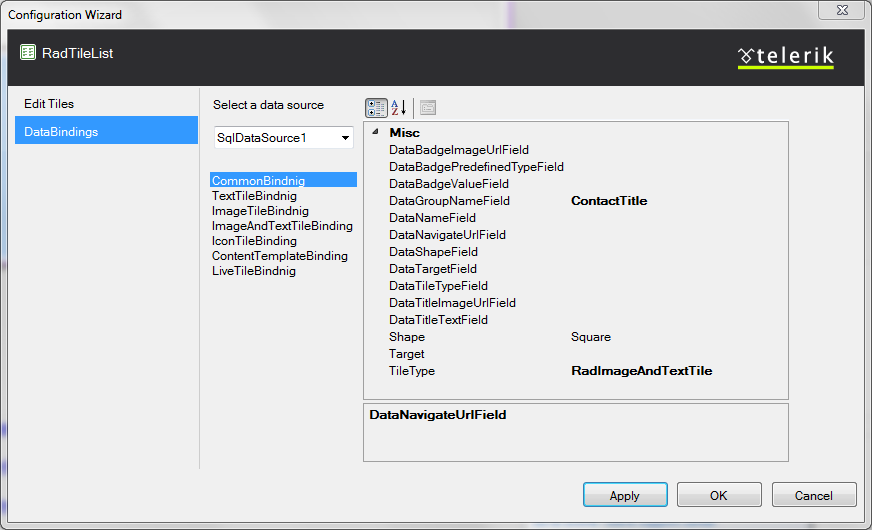

# Design Time

**RadTileList** offers a design-time configurator for Visual Studio that you can use to select and setup its datasource and databinding settings, set several main properties	and edit the tiles collection. You can also perform several other tasks like changing the skin of the control,	adding a RadAjaxManager, RadScriptManager and RadStyleSheetManager.	These options are accessed through the **Smart Tag** of the control:

>caption RadTileList Smart Tag

## Data Source Setup

The first item is a dropdown populated with the declarative data sources on the page. Once a data source is selected (or created through Visual Studio's wizard)the two lines below it let you configure or refresh it. They are both features exposed by Visual Studio.

## Main RadTileList Properties

After the datasource configuration the main properties that control the **RadTileList's** appearance are exposed for easy access:

* **TileRows**: the number of rows in which tiles will be distributed. Defaults to 3.

* **Width**: the width of the control. If there are more tiles than the designated width a scrollbar appears by default.

* **Height**: the height of the control. Typically, RadTileList calculates it based on the number of rows and you need not set it.

## Configuration Wizard

The **Configuration Wizard** link opens the wizard you can use to edit the collection of [Tiles]() and setup the [databinding]() settings of the control:
>caption RadTileList Configuration Wizard - Tile Collection editor

The first tab on the left lets you edit the static tiles in the control. The buttons in the middle section let you edit the list below them and the pane on the right exposes the properties of a selected tile or group.

>caption RadTileList Configuration Wizard - Databinding settings editor

In the databinding settings tab you can, once again, select an existing datasource, or create a new one.Below the dropdown the sections that define the databinding settings are exposed. One for the common settings and one section for each tile type with it specific options.The properties exposed by each settings group can be modified in the right pane.

## Ajax Resources

* The **Add RadAjaxManager...** link adds a RadAjaxManager component to your Web page,so you can configure partial postbacks through a comfortable control.

* The **Replace ScriptManager with RadScriptManager** link replaces the default ScriptManager component that is usedfor AJAX-enabled Web sites with RadScriptManager. If there isn't a ScriptManager on the page this link will allow you to add one.

* The **AddRadStyleSheetManager** link adds a RadStyleSheetManager to your Web page.

## Choosing the Skin

The **Skin** dropdown lists all available skins for the control so you can select one that matches the look and feel of the rest of the page.The skins are displayed via small images to give you a better idea of the color scheme they use.

## Learning Center

The last section of the Smart Tag provides several links navigate you directly to the RadTileList online examples, help, or code library.
