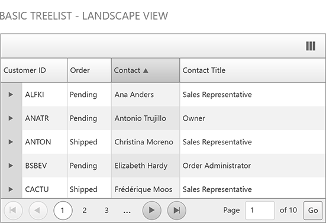





# Mobile Rendering Overview

Since Q2 2015release of Telerik UI controls **RadTreeList** is optimized for touch devices and comes with built-in **Adaptive behaviour**.When you access the treelist control via a mobile device, the control will change to create a user experience tailored to the device screen size. In this mode,RadTreeList is mobile-friendly and its touch zones are bigger and easier to select.

## Mobile vs Auto render modes

You can enable the mobile layout of the control by setting the **RenderMode** property of the TreeList to **"Mobile"**. To cover the rendering of both mobile and desktop devices, you could set the**RenderMode** property to **"Auto"**. This option will automatically decide how to render the control on a smart phone, tablet or PC.

## Special Mobile rendering features

When you change the treelist **RenderMode** to **Mobile** or **Auto** a context menu placed at the top right corner of the treelist will appear.By clicking on it you can reduce the columns number on the client or rearrange them in the desired order.
The context menu button will appear in case the reordering or show/hide feature of the columns are enabled (**AllowColumnsReorder** and **AllowColumnHide** are set to true by default).

Telerik ASP.NET TreeList Adaptive behavior supports easy editing for users on both desktop and mobile. When the demo is opened on a mobile device the **PopUp** edit form will take the entire RadTreeList container and position **Save** and**Cancel** buttons at the top for a better user experience. You can turn on this feature by setting the RadTreeList **RenderMode** property to **Auto** and setting the **EditMode** property to **PopUp**. It's as simple as that.

>note Only **NextPrevNumericAndAdvanced** pager mode is supported for mobile devices. 
>
